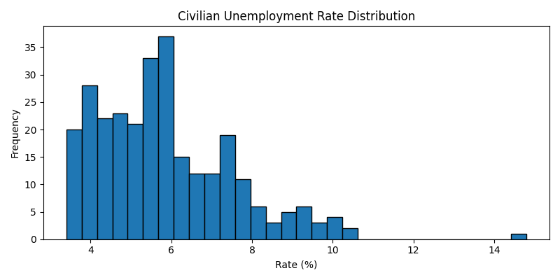
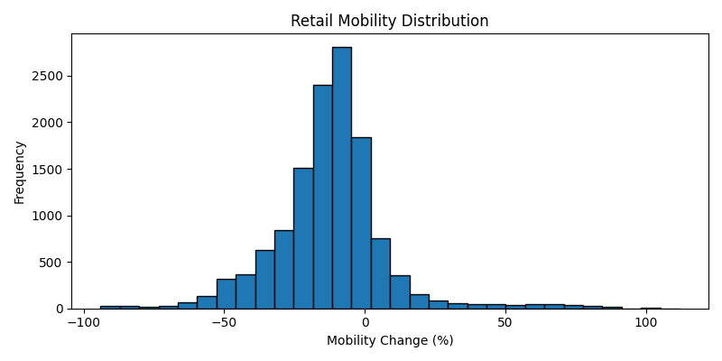

# Commercial Real Estate Stress Test Pipeline

A supervisory-style stress-testing pipeline for **commercial real estate (CRE)** exposures. The pipeline ingests macro and mobility data, defines stress scenarios driven by unemployment and mobility shocks, and produces a stress-test report rendered as a standalone HTML document.

## Reports

- **[index.html](index.html)** — full CRE stress-test pipeline write-up: data sources, scenario design, methodology, and results.
- **[costar.html](costar.html)** — CoStar-Group-focused variant of the pipeline, scoped to property-level CRE data.

## Inputs

The two distributions below summarize the historical stress drivers used to calibrate scenarios:

| | |
|---|---|
|  |  |
| Historical distribution of the U.S. unemployment rate (FRED `UNRATE`). | Historical distribution of mobility indicators used as a demand-side shock. |

## Methodology

1. **Data ingestion** — pulls macro indicators (e.g. FRED `UNRATE`) and mobility data.
2. **Distributional analysis** — characterizes the historical distribution of stress drivers (histograms above).
3. **Scenario definition** — defines baseline / adverse / severely-adverse scenarios as quantile shocks to the drivers.
4. **CRE exposure impact** — translates driver shocks into CRE loss / vacancy / valuation impact estimates.
5. **Reporting** — renders the full write-up as `index.html` (or `costar.html` for the property-level variant).

## Reproducing

The HTML reports in this repo are the rendered outputs. To regenerate from source, see the analysis scripts referenced inside the reports.

## Context

This project was inspired by the kind of supervisory stress-test exercises used by U.S. bank regulators (e.g. CCAR / DFAST) to assess capital adequacy under adverse macro scenarios.
